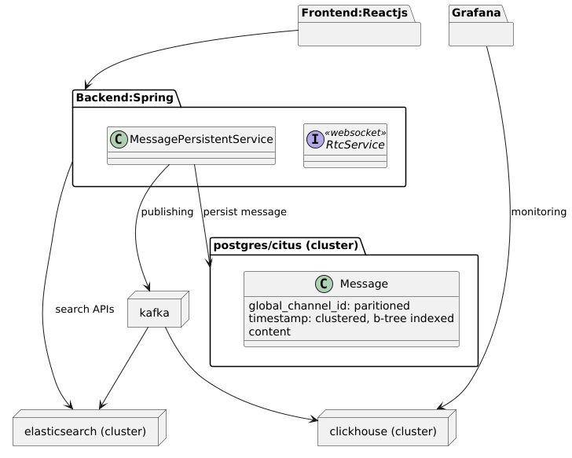

## Scalable RTC Application
#### A demo implementation for scalable design of RTC application. Components:
1. Backend Service: stateless jwt, using external message broker for delivering realtime messages.
2. Postgres/Citus for message persistence
3. Elastic search for searching message
4. CLickHouse for monitoring system
5. Kafka for publishing realtime message, publishing data to CLickHouse and Elasticsearch

Arch:
